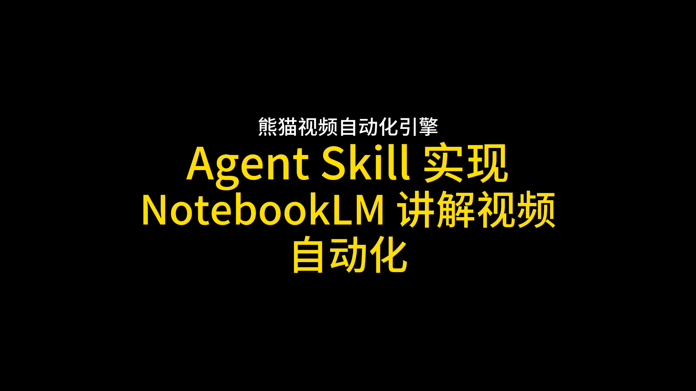
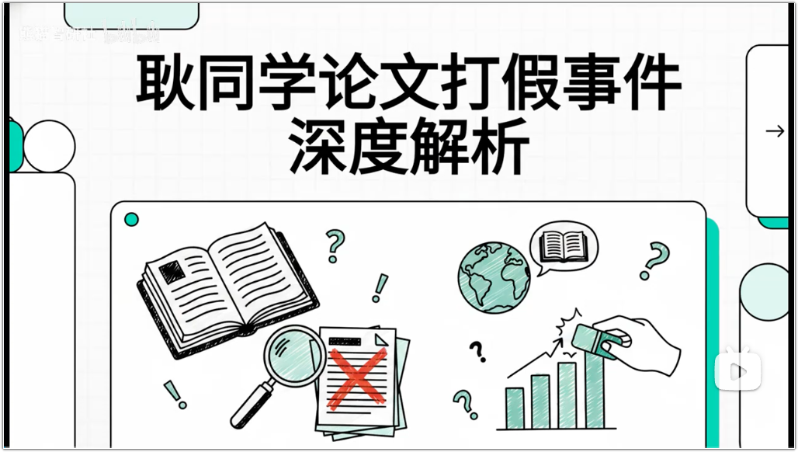

  
  
  # Panda Video Automation - NotebookLM Integration
  
  **熊猫视频自动化生态下的 NotebookLM 笔记转视频自动化工具集**

  
  

---

  <a href="https://panda.szhshp.org" title="Panda Video 项目主页" style="display: inline-block; padding: 12px 28px; border: 2px solid #0969da; border-radius: 8px; font-weight: 700; font-size: 1.05em; text-decoration: none; color: #fff; background: #0969da;">🌐 项目主页</a>

## ❇️ 功能演示

**🤖 工作流演示** — 工具操作全流程

---

## 上游项目

- V1: 一切的起源-熊猫视频自动化引擎
  - [Panda Video Generator](https://github.com/szhshp/panda-video-generator)
- V2: 已开源-熊猫视频自动化发布工具
  - [panda-video-automations-publisher](https://github.com/szhshp/panda-video-automations-publisher)

## ✨ 核心特性
<!-- TODO -->

<!-- GitHub.com strips most flex/gap inline styles; use a plain row table so 3 columns match on the website. -->
<table cellspacing="20" cellpadding="0" border="0">
  <tr valign="top">
    <td width="34%" valign="top">
      <h3>📝 <mark>一键</mark> NotebookLM 研究</h3>
      
一键创建笔记本, Web 研究, 导入来源, 自动完成 NotebookLM 研究流程. 

    </td>
    <td width="33%" valign="top">
      <h3>🎬 <mark>一键</mark>视频生成</h3>
      
一键从 NotebookLM 笔记本导出视频制品 (Deep Dive 对话 / 音频概览) , 自动下载并准备上传. 

    </td>
    <td width="33%" valign="top">
      <h3>🚀 <mark>一键</mark>多平台发布</h3>
      
一键驱动浏览器自动化上传; B 站, 抖音, 微信视频号, 小红书等共用相近流程. 

    </td>
  </tr>
</table>

## 接入方式

<table cellspacing="20" cellpadding="0" border="0">
  <tr valign="top">
    <td width="100%" valign="top">
      <h3>🤖 Agent Skills 方式</h3>
      <ul>
        <li>在 AI Agent 中直接运行技能, 编排 NotebookLM 视频生成流程. </li>
        <li>支持研究, 视频下载, 多平台上传等技能. </li>
        <li>支持 Cursor, Claude Code, Copilot 等常用 AI Agent. </li>
      </ul>
      
无需手动安装 CLI, 首次运行 <code>/setup-pva-notebooklm</code> 技能即可自动完成依赖检查和安装. 

    </td>
  </tr>
</table>

---
<!-- TODO -->

## 📖 简介

把 NotebookLM 里的研究成果一键变成视频，再自动发到 B 站、抖音、视频号——这就是 **Panda Video — NotebookLM**。

它脱胎于 [Panda Video Generator](https://github.com/szhshp/panda-video-generator) 的视频生产流水线，上传模块来自 [panda-video-automations-publisher](https://github.com/szhshp/panda-video-automations-publisher)。从创建笔记本、做研究、导出视频，到多平台发布，一条命令全搞定。不用手动下载、不用反复登录、不用逐个平台传。

---

## ❇️ 成品展示

**🎬 成品展示** — NotebookLM 成品视频示例

---

## 🚀 快速开始

### TL'DR

向 Agent (一次性或分步) 发送以下文本:

1. `/setup-pva-notebooklm` 检查并安装所有前置依赖
2. `/notebooklm-status` 检查我的登录状态
3. `/notebooklm-research` 创建一个 NotebookLM 笔记本并执行深度研究, 研究主题是 "AI 泡沫还能持续多久? "
4. (5 分钟后) `/notebooklm-video` 从笔记本生成一个视频
6. (15 分钟后) `/notebooklm-status` 查看笔记本和视频制品状态, 确认视频已生成并下载到本地
6. 使用 `pva CLI` 登录特定平台并上传视频, 我需要登录到 B 站和抖音 (如果不久前已登录过, 则跳过登录步骤)
7. 帮我批量发布到 B 站和抖音

### 先决条件

- **Python 3** 
  — [notebooklm-py](https://pypi.org/project/notebooklm-py/)
- **Node.js 20+**
  — [@panda-video-automation/pva](https://www.npmjs.com/package/@panda-video-automation/pva)

---

## 🧩 可用技能

| 技能 | 说明 |
|------|------|
| `setup-pva-notebooklm` | 检查所有前置依赖 (Python, Node.js, notebooklm-py, PVA) |
| `setup-pva-notebooklm` | 安装 @panda-video-automation/pva |
| `notebooklm-status` | 查看所有笔记本及制品状态 |
| `notebooklm-research` | 创建笔记本并执行深度研究 |
| `notebooklm-prep-upload` | 准备上传内容到 NotebookLM |
| `notebooklm-video` | 从笔记本生成视频 |

---

## 🤝 贡献

欢迎提交 Issue 和 Pull Request! 

---

## 📄 许可证

本项目采用 MIT 许可证. 详见 [LICENSE](LICENSE) 文件. 

---

## 👤 作者

**szhshp**

- Email: 24031shp@sina.com
- GitHub: [@szhshp](https://github.com/szhshp)

---

## ⚠️ 免责声明

本项目按「原样」提供, 作者不对因使用本软件而产生的任何直接, 间接或附带损失承担责任. 你在使用爬虫, 文本转语音, 视频生成, 浏览器自动化上传等功能时, 须**自行确保**符合适用法律法规, 各内容/社交平台的服务条款, robots 规则及版权与隐私要求; 请勿将本工具用于未经授权的抓取, 侵权转载或垃圾信息传播. 本仓库与第三方平台**无任何隶属或合作关系**; 相关商标与产品名称归各自权利人所有. 以上说明不构成法律意见; 如有合规疑虑, 请咨询专业人士. 

---

  Made with ❤️ by szhshp x 熊猫智研社

